# Wicer Experience — Bản đặc tả để build lại (Rebuild Spec)

> Tài liệu này mô tả TOÀN BỘ bối cảnh, kiến trúc, dữ liệu, luật nghiệp vụ và tích hợp của hệ thống **Wicer** (nội bộ Wicom).
> Mục đích: cầm tài liệu này + codebase cũ để **xây lại từ đầu cho chuẩn**. Đọc mục 12 (Khuyến nghị) trước khi bắt tay.

---

## 1. Bối cảnh & mục tiêu

**Wicer** là "super-app trải nghiệm nhân sự" nội bộ của **Công ty CP Wicom** — nhúng trong **Lark** (Larksuite quốc tế), giúp gắn kết nhân viên qua 3 trụ cột:

- **Move4Wishare** — vận động (Strava/nhập tay) quy đổi thành **quỹ gây quỹ** (VND) + bảng xếp hạng.
- **WiThanks** — "nền kinh tế khoai 🥔": nhân viên tặng nhau **khoai** kèm lời cảm ơn, tích luỹ đổi quà.
- **Wicer Card** — bốc thẻ văn hoá mỗi ngày, sưu tập, thưởng khoai.

Người dùng: ~25 nhân sự Wicom (Việt Nam), đăng nhập bằng **Lark SSO**. Admin/HR có khu **HR Setting**.

**Triết lý thiết kế:** 1 chạm — "Wicer Board" gom 4 tab dùng hằng ngày; các khu chuyên biệt ở sidebar.

---

## 2. Kiến trúc & tech stack

| Lớp | Công nghệ |
|---|---|
| Framework | **Next.js 15** (App Router) + **React 19** + **TypeScript 5.7** |
| DB | **PostgreSQL** (Neon serverless) qua **Prisma 6** |
| Auth/session | **jose** JWT (HS256), cookie `wm_session` |
| Styling | **CSS thuần** trong 1 file `globals.css` + CSS custom properties (KHÔNG Tailwind) |
| Bản đồ | **Leaflet** (OpenStreetMap) cho tuyến GPS |
| Hạ tầng | **Vercel** (serverless + cron) |
| Tích hợp | **Lark** (SSO OAuth + H5 免登 + Bot + Event) · **Strava** (OAuth + webhook) |

**Quy mô hiện tại:** 21 model Prisma · 44 API route · 46 component/page · 22 lib module.

**Đặc điểm SPA:** toàn app chạy trong 1 client shell (`AppShell`) — điều hướng bằng React state + **History API** (URL đồng bộ, không full reload), các khu nặng **giữ-mounted** để quay lại không tải lại.

---

## 3. Mô hình dữ liệu (Prisma models)

### Nhân sự & xác thực
- **Employee** — hồ sơ gốc. Khoá: `larkOpenId` (unique). Trường quan trọng:
  - `khoaiBalance Int @default(50)` — **ví NHẬN** (khoai tích luỹ để đổi quà).
  - `wiRole String` — vai trò quyết định **hạn mức tặng** (staff/lead/…).
  - `isAdmin`, `isHR` — phân quyền.
  - `larkNotify{Thanks,Comment,Activity,Reaction,Digest} Boolean` — công tắc thông báo Lark.
  - `athleticTitles String[]`, `team`, `title`, `birthday`, `joinedAt`, `leftAt`.
- **StravaAccount** — token Strava của nhân sự (athleteId, access/refresh, revokedAt).

### Move4Wishare
- **Activity** — buổi tập. `source` = strava|manual; `type` (Run/Ride/Swim/…); `distanceKm`, `movingTimeS`, `amountVnd` (quỹ tạo ra), `mapPolyline`, `kindKey` (môn tay), `isFlagged` (chờ duyệt), `reviewedAt/rejectedAt` (duyệt tay), `stravaId`.
- **ActivityKind** — môn tự thêm (vd Cầu lông) + công thức quy đổi.
- **ConversionRule** — quy tắc quy đổi km/buổi → VND.
- **Campaign** — chiến dịch gây quỹ (`goalVnd`, `startDate/endDate`, `active`).
- **Goal** — mục tiêu cá nhân (`sport`, `metric`, `target`, `period`, nhắc qua Lark: `remindEveryDays`, `remindHour`, `lastRemindedAt`).
- **Comment**, **Reaction** — tương tác trên hoạt động (feed).

### WiThanks (kinh tế khoai)
- **ThanksGift** — 1 lời cảm ơn. `senderId`, `receiverId`, `khoai`, `message`, `kind` = **thanks|super|special**, `valueTags String[]` (giá trị cốt lõi), `anonymous`, `heartCount`.
- **ThanksHeart** — "thả tim" 1 kudo (unique [thanksId, employeeId]).
- **KhoaiTransaction** — **SỔ CÁI** ví nhận. Mọi thay đổi `khoaiBalance` ĐI QUA đây: `delta`, `balanceAfter`, `reason` (thanks|super|special|redeem|card|contribution|admin|opening|refund), `refType/refId`, `createdById`. → nguồn audit & thống kê.
- **Reward** — quà đổi thưởng. `costKhoai`, `kind` (main/squad/greenfield…), `goalKhoai` (quà cộng đồng), `active`, `sortOrder`.
- **Redemption** — lượt đổi quà (`costKhoai` snapshot, `status` pending|fulfilled).
- **Contribution** — góp khoai vào quà cộng đồng.
- **Fulfillment** — hàng đợi HR trao quà thật (Special Gift/redemption): `kind`, `title`, `counterpart`, `status`, `hrNote`, `fulfilledAt`.

### Wicer Card
- **WicerCard** — thẻ trong bộ (message, category, emoji, background, `rarity`, `rewardKhoai`, active).
- **CardDraw** — lượt bốc/ngày (unique [employeeId, dateKey]).

### Khác
- **Setting** — key/value cấu hình chung.
- **EmployeeNote** — ghi chú HR về nhân sự.
- **LarkEventLog** — `msgId @id` — **chống xử lý trùng** event tặng khoai từ Lark group.

### 3.1 Sơ đồ quan hệ (ERD)

> **Employee** là thực thể trung tâm. **ThanksGift** + **KhoaiTransaction** là trái tim của "kinh tế khoai".

```mermaid
erDiagram
    Employee ||--o| StravaAccount : "kết nối Strava"
    Employee ||--o{ Activity : "ghi nhận"
    Employee ||--o{ Goal : "đặt mục tiêu"
    Employee ||--o{ ThanksGift : "gửi (senderId)"
    Employee ||--o{ ThanksGift : "nhận (receiverId)"
    Employee ||--o{ ThanksHeart : "thả tim"
    Employee ||--o{ KhoaiTransaction : "sổ cái ví"
    Employee ||--o{ CardDraw : "bốc thẻ"
    Employee ||--o{ Comment : "bình luận"
    Employee ||--o{ Reaction : "cảm xúc"
    Employee ||--o{ Redemption : "đổi quà"
    Employee ||--o{ Contribution : "góp khoai"
    Employee ||--o{ Fulfillment : "được trao quà thật"
    Employee ||--o{ EmployeeNote : "ghi chú HR"

    Activity ||--o{ Comment : "có"
    Activity ||--o{ Reaction : "có"
    ActivityKind ||..o{ Activity : "kindKey (soft-ref)"

    ThanksGift ||--o{ ThanksHeart : "được thả tim"

    WicerCard ||--o{ CardDraw : "phát"

    Reward ||--o{ Redemption : "được đổi"
    Reward ||--o{ Contribution : "được góp"

    Employee {
        string id PK
        string larkOpenId UK
        string name
        int khoaiBalance "ví NHẬN (default 50)"
        string wiRole "quyết định hạn mức tặng"
        bool isAdmin
        bool isHR
        string_arr athleticTitles
    }
    Activity {
        string id PK
        string employeeId FK
        string source "strava | manual"
        float distanceKm
        int amountVnd "quỹ VND tạo ra"
        bool isFlagged "chờ HR duyệt"
        string kindKey "→ ActivityKind"
    }
    ThanksGift {
        string id PK
        string senderId FK
        string receiverId FK
        int khoai
        string kind "thanks | super | special"
        string_arr valueTags
        int heartCount
    }
    KhoaiTransaction {
        string id PK
        string employeeId FK
        int delta "+ / -"
        int balanceAfter
        string reason "thanks|super|special|redeem|card|contribution|admin"
        string refType "ThanksGift|Redemption|CardDraw|..."
    }
    Reward {
        string id PK
        int costKhoai
        string kind "main | squad | greenfield"
        int goalKhoai "quà cộng đồng"
    }
    Redemption {
        string id PK
        string employeeId FK
        string rewardId FK
        int costKhoai
        string status "pending | fulfilled"
    }
    Fulfillment {
        string id PK
        string employeeId FK
        string kind "special | redeem"
        string status "pending | fulfilled"
    }
    CardDraw {
        string id PK
        string employeeId FK
        string cardId FK
        string dateKey "1 lượt / ngày (VN)"
    }
```

**Bảng độc lập (không FK):** `Campaign`, `ConversionRule`, `ActivityKind` (Activity tham chiếu mềm qua `kindKey`), `Setting`, `LarkEventLog`.
**Tự tham chiếu:** `EmployeeNote.authorId → Employee` (ai viết ghi chú).

---

## 4. Xác thực & phiên

Có **3 đường đăng nhập**, tất cả đổ về `loginLarkUser()` (upsert Employee theo `larkOpenId` + tạo session):

1. **Lark OAuth web** (`/api/auth/lark` → `/api/auth/lark/callback`): luồng "passport" của Larksuite (`accounts.larksuite.com/…/authorize` → `passport.larksuite.com/…/token` + `/userinfo`). Dùng `LARK_CLIENT_ID/SECRET`.
2. **Lark H5 免登** (đăng nhập ngầm khi mở app TRONG Lark) — `LarkAutoLogin` (client) nạp **Lark JSSDK** → `tt.requestAuthCode` lấy code ngầm → `POST /api/auth/lark/silent` → đổi code qua **`app_access_token`** + `open-apis/authen/v1/access_token` → session. Không cần bấm nút.
3. **Dev login** (`/api/dev/login?id=…`) — CHỈ non-production (tự chặn khi `NODE_ENV=production`), để test local không cần Lark.

**Session:** `lib/session.ts` — jose JWT HS256, secret `SESSION_SECRET`, cookie `wm_session` (httpOnly). `getSession()` / `createSession({employeeId,name,isAdmin})`.

**Bootstrap admin:** email trong `ADMIN_EMAILS` → tự nâng `isAdmin` khi đăng nhập (chỉ nâng, không hạ).

---

## 5. Các module tính năng (to → nhỏ)

### 5.1 Wicer Board (shell điều hướng) — `AppShell.tsx`
- Rail + Sidebar + Header. 4 tab hub: **Wicer Home · Move4Wishare · WiThanks · Wigrow(sắp có)**.
- Sidebar: Wicer Board, Records/Learn/AI (placeholder), **HR Setting** (admin/HR).
- **URL đồng bộ** qua History API: `/dashboard?tab=`, `/me`, `/dashboard?area=hrsetting`, `/activity/[id]`. Back/Forward + reload đúng.
- **Giữ-mounted** hub + MyPage + HR Setting (chỉ ẩn/hiện) → chuyển trang không fetch lại. **Lazy-mount** + **prefetch** tab sau ~1.5s.

### 5.2 Wicer Home — `home/WicerHome.tsx` + `/api/wicer-home`
Trang cá nhân "sáng nay": Level/XP, 3 rings (km tuần + đã cho khoai), streak tuần, huy hiệu, bộ thẻ, **nudges** (hạn mức còn, quà chờ, mục tiêu), **pulse** công ty (sinh nhật/kỷ niệm/thành viên mới/ai vận động hôm nay), **vinh danh tuần** (được cảm ơn nhất + quán quân Move).
- `computeXp` / `levelFromXp` (lib/wicer): XP từ activityCount, khoaiSent, khoaiReceived, badgeTiers, ringWeeks.
- `badgeMetrics`/`computeBadgeStates` (lib/badges): huy hiệu theo **phần trăm** so với toàn công ty (streak/early/km/hikes/vnd/count).

### 5.3 Move4Wishare — `dashboard/*` + `/api/dashboard`, `/api/feed`
- **Strava**: connect (`/api/strava/connect|callback`), webhook (`/api/strava/webhook` → `ingest.upsertActivity`), backfill lịch sử.
- **Nhập tay**: `/api/me/submit` (tạo Activity `isFlagged=true`, amountVnd=0) → HR duyệt `/api/admin/approvals` → quy đổi `amountVnd`.
- **Quy đổi**: `lib/conversion` + `lib/kinds` (km/buổi → VND), mốc bắt đầu quy đổi `CONVERSION_FROM_DATE`.
- **Campaign & quỹ**: dashboard tính quỹ kỳ + nhiệt kế "hôm nay +X", biểu đồ quỹ theo thời gian, KPI theo môn.
- **Bảng xếp hạng**: aggregate theo nhân sự + thay đổi thứ hạng ▲▼ (so kỳ trước).
- **Feed** (MoveFeed/ActivityFeed): card kiểu Strava + bản đồ tuyến (Leaflet) + comment + reaction (nhiều loại) + "kudos".
- **Goals**: mục tiêu cá nhân + nhắc qua Lark (cron goal-reminders).

### 5.4 WiThanks — "kinh tế khoai" — `withanks/*` + `/api/withanks*`
**3 nấc tặng** (`/api/withanks/give`, dùng chung `giveThanks` logic — khoá `pg_advisory_xact_lock` chống double-spend):
| Nấc | Khoai | Trừ ai | Giới hạn | Msg min |
|---|---|---|---|---|
| **Thanks** | user chọn | KHÔNG trừ ví người gửi (tiêu **hạn mức tuần/tháng**) | trần `perPersonDay`/người + hạn mức role | 10 ký tự |
| **Super** | 30 (cố định) | không trừ ví | 1/tháng/người | 80 ký tự |
| **Special** | 100 (cố định) | **TRỪ 100🥔 ví người GỬI** | 1/năm, thâm niên ≥180 ngày | 80 ký tự |

- **Thanks/Super**: người nhận **được cộng** khoai (`creditKhoai` → ví + ledger).
- **Special**: người nhận KHÔNG cộng khoai — tạo **Fulfillment** để HR trao **quà thật** (ngân sách ~500k).
- **Hạn mức** (`lib/withanks` `computeAllowance`): theo `ROLE_LIMITS[wiRole]` → `weekLimit`, `monthLimit`, `perPersonDay`; admin = unlimited. Hạn mức TÍNH bằng **tổng ThanksGift đã gửi** trong tuần/tháng (không có field "quota" riêng).
- **Value tags** — gắn giá trị cốt lõi vào lời cảm ơn.
- **Kudos Board** (`WiThanks.tsx`): người gieo khoai + kudos dạng thẻ tròn + thả tim (ThanksHeart).
- **Đổi quà**: Reward → Redemption/Contribution → Fulfillment (HR Console). Squad/Green Field = quà cộng đồng.

### 5.5 Wicer Card — `home/CardCollectionModal.tsx` + `/api/wicer-home/card|collection`
Bốc 1 thẻ/ngày (`CardDraw`, khoá theo `dateKey` VN), độ hiếm (rarity), thưởng `rewardKhoai` (credit ví). Bộ sưu tập + đánh dấu yêu thích.

### 5.6 HR Setting — `admin/HRSetting.tsx`
4 nhóm theo tính năng:
- **Nhân sự** — danh sách + phân quyền (EmployeesTab).
- **Move4Wishare** — Chiến dịch, Quy đổi, Môn tự thêm, Duyệt hoạt động tay, Cài đặt chung.
- **WiThanks** — **Quà & Khoai** (WiThanksTab: quản lý quà, hàng đợi Fulfillment) + **Kinh tế khoai** (EconomyTab — xem dưới).
- **Wicer Card** — CRUD thẻ.

**Bảng "Kinh tế khoai"** (`EconomyTab` + `/api/admin/withanks-economy`, HR-only, read-only): mỗi nhân sự — ví khoai, đã cho/nhận (Thanks), super gửi/nhận, special gửi/nhận, đã đổi quà, lượt cho/nhận, số người đã cảm ơn, hạn mức còn tuần/tháng, cảm ơn gần nhất. + dải KPI công ty, lọc thời gian (all/tháng/tuần), sắp xếp, tìm, **xuất CSV**, dòng tổng.

### 5.7 Tích hợp Lark (chi tiết mục 6)
Bot thông báo · Web App H5 免登 · Tặng khoai bằng 🥔 trong group.

---

## 6. Tích hợp Lark (Larksuite quốc tế, `open.larksuite.com`)

### 6.1 Bot thông báo — `lib/larkNotify.ts`
- Token: `tenant_access_token` (cache in-memory) từ `LARK_CLIENT_ID/SECRET`.
- Gửi **card tương tác** (`mkCard`/`mdEl`/`fieldsEl`/`btnEl`…) qua `im/v1/messages?receive_id_type=open_id`; lỗi card → fallback text.
- Sự kiện bắn (gate theo công tắc `larkNotify*` của nhân sự): nhận/gửi khoai (Thanks/Super/Special), hoạt động mới (Strava/duyệt tay), comment, reaction, **tổng kết tuần** (cron sáng thứ 2).
- Footer card: `❤️ WiThanks`. Nút "WiThanks →" mở tab WiThanks.

### 6.2 Web App H5 (免登) — mục 4.2
Bật "Web App" trong Developer Console, homepage = URL Vercel, thêm domain vào **Trusted domain**. `LarkAutoLogin` tự đăng nhập.

### 6.3 Tặng khoai bằng 🥔 trong group — `/api/lark/events` + `lib/larkGive.ts`
- **Event subscription** `im.message.receive_v1` (chế độ **Request URL** = `/api/lark/events`, KHÔNG dùng persistent connection). Cần scope **"đọc mọi tin nhắn trong group"** (sensitive). Xác thực challenge + `LARK_VERIFICATION_TOKEN` (+ giải mã `LARK_ENCRYPT_KEY` nếu bật).
- **Parse**: đếm 🥔 (Unicode + token `[Potato]`/`[khoai]`) = số khoai; `@mention` (map open_id → nhân sự) = người nhận; **chỉ kích hoạt khi CÓ 🥔 VÀ CÓ @người**. `stripPotatoes()` bỏ 🥔 khỏi lời nhắn.
- **Thực thi**: `giveThanksFromLark` — **tái dùng đúng luật Thanks** (hạn mức + ledger + advisory lock). Chống trùng qua `LarkEventLog`.
- **Phản hồi**: thả reaction 🥔 lên tin gốc + **DM card** (dùng lại `notifyThanksGiven/Received` — giống app) cho người gửi & nhận. Lỗi nghiệp vụ → DM riêng người gửi.
- **Quan trọng**: khoai tặng qua Lark ghi vào **cùng `ThanksGift` + `KhoaiTransaction`** → tự hiện ở Kudos Board, ví, hạn mức, thống kê như tặng trên web.

---

## 7. Luật nghiệp vụ cốt lõi (đừng làm sai khi build lại)

- **Ví khoai vs Hạn mức**: "Thanks/Super" tiêu **hạn mức tặng** (quota tuần/tháng, tính từ tổng ThanksGift đã gửi), KHÔNG trừ ví. Chỉ **Special** trừ 100🥔 ví người gửi. Người nhận Thanks/Super **được cộng ví**; Special nhận **quà thật** (không cộng ví).
- **Mọi thay đổi ví** phải qua `creditKhoai/debitKhoai` (ledger `KhoaiTransaction`) — không update `khoaiBalance` trực tiếp.
- **Chống double-spend**: transaction + `pg_advisory_xact_lock(hashtext(senderId))`.
- **Timezone VN**: dùng `weekStartVN/monthStartVN/dayStartVN/dateKeyVN` (UTC+7) cho mọi mốc thời gian.
- **Quy đổi hoạt động** chỉ áp từ `CONVERSION_FROM_DATE`; hoạt động tay `amountVnd=0` tới khi HR duyệt.
- **XP/Level/Badge**: badge tính theo **phần trăm** so toàn công ty; XP tổng hợp nhiều nguồn.
- **Wicer Card**: 1 lượt bốc/ngày theo `dateKey` VN.

---

## 8. API routes (nhóm)

- **auth**: `/auth/lark`, `/auth/lark/callback`, `/auth/lark/silent`, `/auth/logout`, `/dev/login`
- **me**: `/me`, `/me/submit`, `/me/goals`, `/me/prefs`
- **home/board**: `/wicer-home`, `/wicer-home/card`, `/wicer-home/collection`, `/dashboard`, `/feed`, `/pulse`, `/employee/[id]`
- **activity**: `/activity/[id]`, `/activity/[id]/comments`, `/activity/[id]/react`
- **withanks**: `/withanks`, `/withanks/give`, `/withanks/members`, `/withanks/heart`, `/withanks/rewards`, `/withanks/contribute`
- **strava**: `/strava/connect|callback|disconnect|webhook`
- **lark**: `/lark/events`
- **admin (HR)**: `/admin/employees|approvals|campaigns|rules|kinds|settings|cards|withanks|withanks-economy`
- **cron**: `/cron/backfill`, `/cron/goal-reminders`, `/cron/morning-nudge`
- **upload**: `/upload`

## 9. Lib modules (22)
`db` (Prisma singleton) · `session` (JWT) · `admin` (requireAdmin/requireHR + bootstrap) · `lark` (OAuth + H5 免登 + loginLarkUser) · `larkNotify` (bot cards) · `larkGive` (group 🥔 give core) · `strava` · `ingest` (upsert activity) · `backfill` · `recompute` · `conversion` · `kinds` · `sports` · `wicer` (XP/level/rings/timezone VN) · `badges` · `withanks` (allowance/tiers/tags) · `khoai` (ledger credit/debit) · `wicerCards` · `goals` · `reactions` · `polyline` · `cache` (revalidateTag helpers).

## 10. Cron jobs (`vercel.json`)
- `/api/cron/backfill` — `0 18 * * *` (đồng bộ Strava lịch sử).
- `/api/cron/goal-reminders` — `0 1 * * *` (nhắc mục tiêu + **tổng kết tuần** sáng thứ 2 VN).
- (Vercel Hobby giới hạn 2 cron/ngày → gộp digest vào goal-reminders.)
- Bảo vệ cron bằng header `Authorization: Bearer ${CRON_SECRET}`.

---

## 11. Triển khai & môi trường

**Hạ tầng**: Vercel (repo GitHub cá nhân) + Neon Postgres. Build: `prisma generate && next build`.

**⚠️ Bài học tốc độ (BẮT BUỘC làm đúng khi build lại):**
- `DATABASE_URL` phải là **chuỗi Neon POOLED** (host có `-pooler`) + `?pgbouncer=true`; thêm `directUrl` (chuỗi direct) cho migrate.
- **Region Vercel = region Neon** (vd cả 2 ở Singapore `sin1`) — lệch region là chậm khủng khiếp.
- Gộp truy vấn **song song** (`Promise.all`), tránh N+1 tuần tự (mỗi round-trip serverless→Neon rất đắt).
- Dùng `unstable_cache` 60s cho dữ liệu **toàn công ty** + `revalidateTag` khi ghi (xem `lib/cache.ts`).

**Biến môi trường** (đầy đủ):
| Nhóm | Biến |
|---|---|
| Core | `DATABASE_URL`, `SESSION_SECRET`, `APP_BASE_URL`, `NODE_ENV`, `ADMIN_EMAILS`, `CRON_SECRET` |
| Lark | `LARK_CLIENT_ID`, `LARK_CLIENT_SECRET`, `LARK_API_BASE`, `LARK_SCOPE`, `LARK_TENANT_KEY`, `LARK_AUTHORIZE_URL`, `LARK_TOKEN_URL`, `LARK_USERINFO_URL`, `LARK_NOTIFY_ENABLED`, `LARK_NOTIFY_DEBUG`, `LARK_VERIFICATION_TOKEN`, `LARK_ENCRYPT_KEY`, `LARK_POTATO_KEYS`, `LARK_POTATO_EMOJI`, `NEXT_PUBLIC_LARK_JSSDK_URL` |
| Strava | `STRAVA_*` (client id/secret), `STRAVA_WEBHOOK_VERIFY_TOKEN` |
| Move | `CONVERSION_FROM_DATE` |

**Migration**: `prisma migrate deploy` chạy bằng chuỗi Neon **direct** (không qua pooler). Vercel KHÔNG tự chạy migrate.

**Cấu hình Lark cần làm tay** (Developer Console): bật Bot + Web App; scope `im:message` (gửi) + đọc-mọi-tin-group + contact + reaction; Event `im.message.receive_v1` (Request URL); Redirect URL OAuth; Trusted domain; **Release version** + Availability.

---

## 12. Khuyến nghị khi build lại "cho chuẩn"

Những điểm nợ kỹ thuật / nên làm khác đi:

1. **Bỏ waterfall client-fetch**: hiện mỗi trang mount rồi mới `fetch` API (TTFB + JS + fetch). Nên **fetch dữ liệu ở Server Component** và truyền xuống props, hoặc dùng **React Query/SWR** (cache, revalidate, optimistic) thay `useEffect+fetch` thủ công.
2. **Bỏ 1 file `globals.css` khổng lồ (~1900 dòng)**: dùng CSS Modules / Tailwind / một design system. Tách token màu brand Wicom (primary `#33A3DC`, navy `#1A4565`) thành theme chuẩn.
3. **Component library**: hiện tự viết Modal/Button/Card/Field. Nên dùng **shadcn/ui** (Vercel) để nhất quán + a11y sẵn.
4. **Chuẩn hoá "route thật"** thay vì SPA state-nav thủ công: dùng App Router segments (`/board/[tab]`, `/me`, `/hr/[section]`) + `<Link>` để URL/back/prefetch tự nhiên, thay cho History API tự chế.
5. **Tách "kinh tế khoai" thành domain rõ**: 1 service `khoai` duy nhất (give/credit/debit/allowance) — mọi kênh (web, Lark group, admin) gọi CÙNG 1 hàm (đã làm 1 phần, nên làm triệt để).
6. **Test**: hiện gần như không có test. Thêm unit test cho luật khoai (allowance, tiers, ledger cân bằng) + integration test cho `/lark/events` parse.
7. **Neon serverless driver** (`@prisma/adapter-neon`) để truy vấn qua HTTP — nhanh trên serverless, đỡ phụ thuộc pooler.
8. **Idempotency & webhook**: chuẩn hoá dedupe (LarkEventLog) cho MỌI webhook (Strava cũng nên có).
9. **i18n**: hiện hard-code tiếng Việt. Nếu mở rộng, tách chuỗi.
10. **Quan sát (observability)**: thêm structured logging + 1 endpoint health/diagnostic (đã có mẫu ở `/api/lark/events` GET).
11. **Phân quyền tập trung**: middleware kiểm tra session/role cho `/api/admin/*` (hiện mỗi route tự `requireHR`).
12. **Tài liệu luật khoai cho PO**: xem thêm `Wicer-Product-Doc` (bản HTML/MD) — mô tả mục tiêu từng tính năng cho Product.

---

## 13. Thứ tự build lại đề xuất
1. Nền tảng: Next.js + Prisma + Neon (pooler + region) + session Lark SSO.
2. Employee + HR Setting (danh sách + quyền).
3. **WiThanks core** (ThanksGift + KhoaiTransaction + allowance + 3 nấc) — trái tim hệ thống.
4. Wicer Home (dashboard cá nhân) + Kudos Board.
5. Move4Wishare (Strava + nhập tay + duyệt + campaign + leaderboard + feed).
6. Wicer Card.
7. Lark Bot notifications → Web App H5 免登 → Group 🥔 give.
8. Bảng Kinh tế khoai + báo cáo.

---
*Sinh từ codebase Wicer (Wicom) — dùng kèm source để rebuild.*
